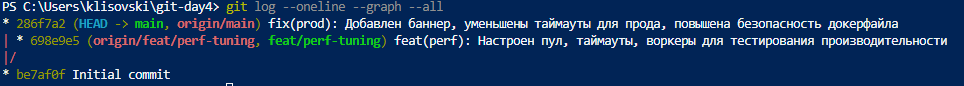
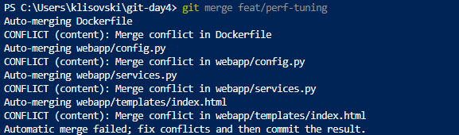
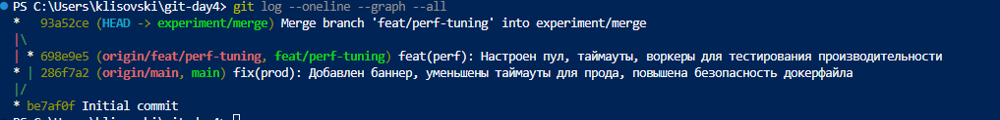
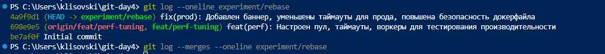
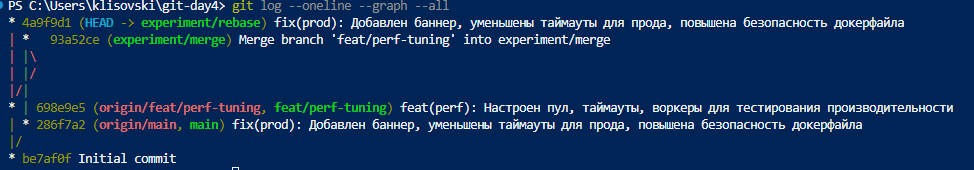
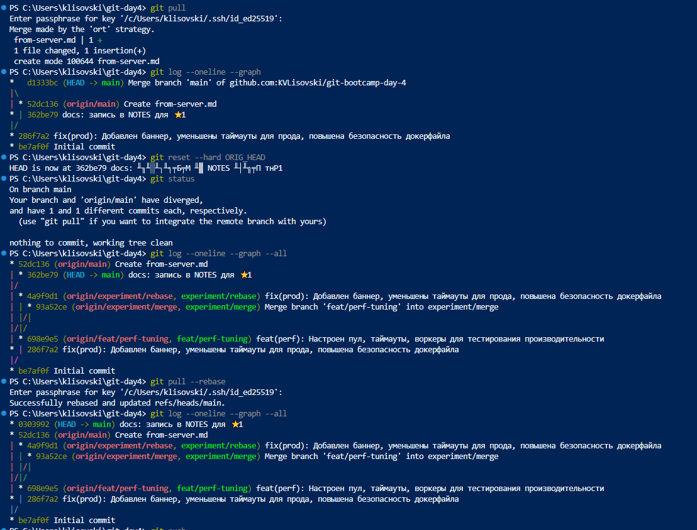
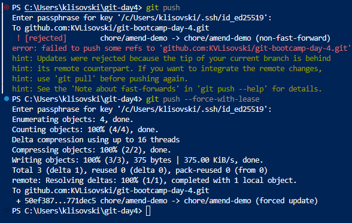
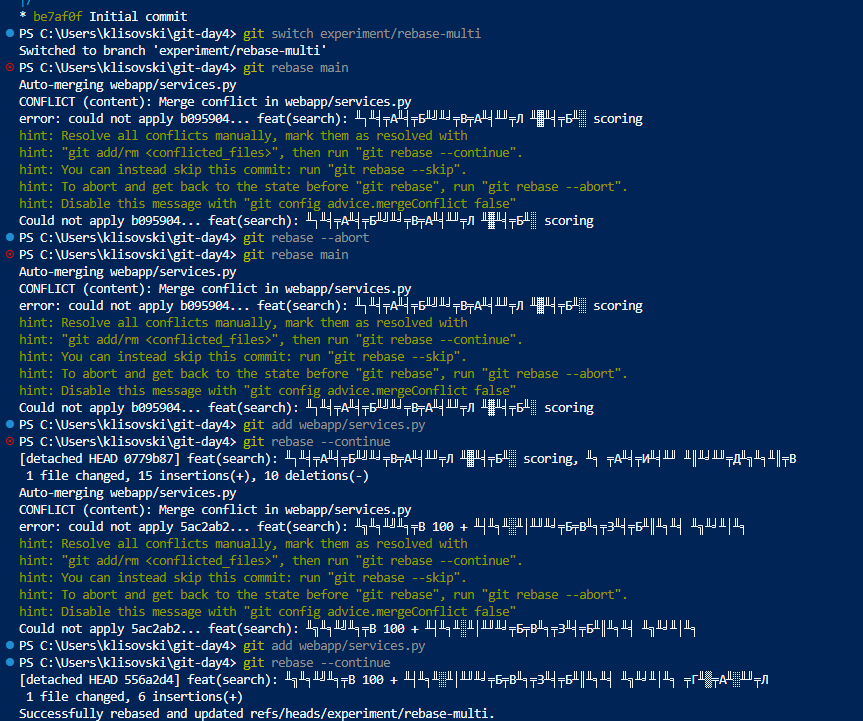
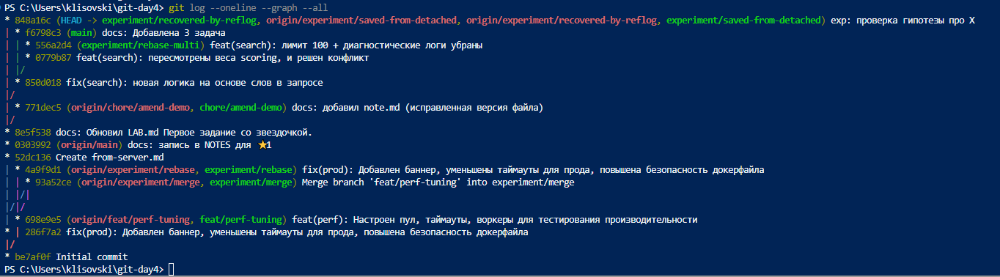

 # LAB — день 4

Курс: [«Интенсив по погружению в GIT»](https://slurm.io/git-intensive)


## Базовая задача — `01-merge-vs-rebase`

### Стартовое состояние

Сначала был создан локальный репозеторий, к нему подключен созданный удаленный. Сделан первый коммит. Далее создана ветка `feat/perf-tuning` для того чтобюы изменить dockerFile, infex.html, config.py и services.py в них проивзедены настройки для нагрузочного тестирования. Далее вернулись в `main` и внесли изменения тимлида для подготовки в прод, тех же файлов.

```bash
# git log --oneline --graph --all (на момент окончания подготовки)
```



### Путь A — через `merge`

На ветке `experiment/merge` был создан новый коммит который имеет двух родителй, решал изменения все через VS Code Merge Editor, в dockerFile выбрал отличный вариант от двух промежуточное значение. В большенсве выбирал входящие изменения. Просто для простоты выполнения. Включить `git config --global merge.conflictstyle diff3` а затем команды ниже, как посмотреть разницу в файле в 3 строннем режиме. Но прок в code посомтреть все "юзер френдли"

```bash
git diff --name-only --diff-filter=U
git diff webapp/config.py
```





### Путь B — через `rebase`

Создана ветка `experiment/rebase` изначально ступил и создал не в изначальном состоянии main, пришлось удалять. Выбрал вариант через хэш (создать ветку с изначальным состоянием main, а не после merge) на мой взгляд самы простой. На какие коммиты конфликты пришлись и как их разрешали. Чем поведение отличалось от пути A.]

```bash
git rebase feat/perf-tuning
# Решить кофликты - в моем случае через VS code
git rebase feat/perf-tuning
```



### Сравнение

Финальная история всех веток рядом:



[FIXME: Что я заметил(а) в процессе сравнения (например):
- размер истории — в случае с rebase коммитов меньше, в merge появляеться два родителя
- наличие/отсутствие merge-коммита —
- хеши коммитов фичи — в случае с rebase меняется хэщ
- видна ли в истории ветка как сущность — в истории видно новую ветку и ее линейное движение 
]

### Какой подход я бы выбрал(а) в команде и почему

В команде я бы выбрал все же merge слияние как мне кажется более подробно видно (как минимум если бегло смотреть) историю изменений

## Задания со звездочкой (опционально)
> это заполняете только если делали. иначе не включайте в отчет и удалите их шаблона

### ⭐1 — `git pull` vs `git pull --rebase`

На локальном репозитории создан файл NODE.md и LAB.md и успешно добавлены коммиты, затем через web добавлен так же файлик from-server.md. Я прошел оба этапа и git pull по умолчанию и rebase. В gitconfig выстаивл true pull.rebase, так как более чистый результат. Хотя при первом варианте он мне предложил самому исправить дефолтное `Merge branch 'main' of github.com:KVLisovski/git-bootcamp-day-4`. 



### ⭐2 — `--force-with-lease` vs `--force`

Была произведена смена хэша коммита, путем изменения файла после того как закоммитили. Просто пуш поэтому и отказал, заметил разницу безопаснее конечно, с опцией --force-with-lease так как идет проверка состояния. Ну а --force насильно изменяет игнорируя чужие изменения. 


### ⭐3 — rebase с конфликтом на каждом коммите

Так, это было нелегко и до сих пор не уверен, что правильно, сделано два `git rebase --continue`. Однозначно без визуального редактора тяжело. По крацйней мере не привычно, что и куда смотреть. 



### ⭐4 — безопасный выход из detached HEAD

Как зашли в detached HEAD, какой коммит сделали, как выходили через `git switch -c`, чем `git reflog` помог как страховка.



